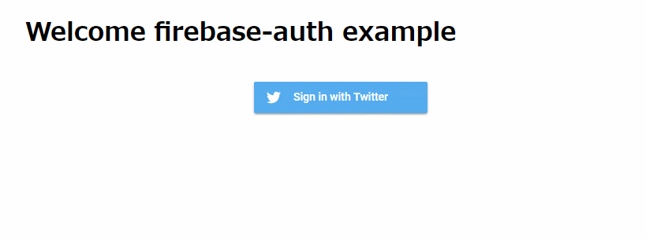

# :fire: Firebase Authentication with Go backend :fire: 

## Usage

1. Open firebase console and enable Twitter authentication ([docs](https://firebase.google.com/docs/auth/))
2. Put your [downloaded firebase private key JSON](https://console.firebase.google.com/project/_/settings/serviceaccounts/adminsdk?hl=ja) as `firebase-secret.json` to project dir
3. Open `index.html` and edit `// Initialize Firebase` section for your firebase project
4. `go run main.go`
5. Open [http://localhost:8080](http://localhost:8080)
